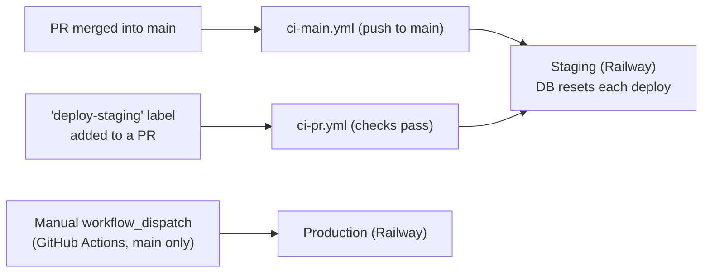
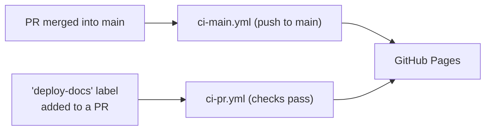

# Contributing

Setup, conventions, and workflows for developing this repo. For the project's purpose and end-user
install instructions, see [`README.md`](README.md).

## Getting Started

```bash
git clone <repo-url>
cd ripe
pnpm install
```

## Coding Standards

See [`STANDARDS.md`](STANDARDS.md) for conventions that apply across the whole workspace, and the
per-package files for package-specific rules: [`api/STANDARDS.md`](api/STANDARDS.md),
[`cli/STANDARDS.md`](cli/STANDARDS.md), [`web/STANDARDS.md`](web/STANDARDS.md).

## Package Commands

Each package (`api`, `./cli`, `web`) exposes the same script names — `lint`, `typecheck`, `test`,
`ci:checks` — via `pnpm --filter <package> <script>`. Only the `--filter` target changes between
packages; check each package's `package.json` for its full script list.

## Manual Local Test

To try a change end-to-end against a real local stack:

1. **API** — `cp api/.env.local.example api/.env.local` (edit `DATABASE_PATH`/`PORT` if needed),
   then `pnpm --filter api start:local`. Runs at `http://localhost:<PORT>`.
2. **CLI** — `pnpm --filter ./cli build`, then `node cli/dist/index.js init`. When prompted for
   the server URL, pass `http://localhost:<PORT>` (the API's `PORT` from step 1).
3. **Web** — `pnpm --filter web dev`. Proxies `/api` to `http://localhost:3000`.

## Runtime & Package Manager Versions

Node and pnpm versions are pinned in `package.json`, but different parts of the SDLC read
different fields:

- **Node**: declared in both `devEngines` and `engines`. Locally and in CI, `actions/setup-node`
  reads `devEngines` first, falling back to `engines` only if it's absent. At deploy time,
  Railway's Railpack builder reads `engines.node` directly and doesn't know about `devEngines`.
- **pnpm**: pinned via `packageManager`, read by `pnpm/action-setup` in CI's setup step.

Both Node fields are kept in sync so every stage resolves the same version.

**Bumping either version**: pnpm itself declares which Node versions it supports via its own
`engines.node` field. Before pinning a new pnpm version, check that field against the Node version
you intend to pin:

```bash
npm view pnpm@<version> engines
```

Pick a Node version that satisfies the range it reports, then update `devEngines`, `engines`, and
`packageManager` together so every stage (CI, Railpack, mise) resolves the same compatible pair.

Renovate bumps `packageManager` and `engines`/`devEngines` independently and doesn't cross-check
them against each other. If it ever proposes an incompatible pair, `pnpm install` fails closed in
CI (`engineStrict`/`pmOnFail` below) instead of merging — if that happens, follow the same manual
process above to work out a compatible pair before re-pinning.

**Using [mise](https://mise.jdx.dev) locally**: mise doesn't pick up `devEngines` or
`packageManager` automatically by default. This repo's `.mise.toml` enables idiomatic version
files for `node` and `pnpm` (see mise's [Node docs](https://mise.jdx.dev/lang/node.html)), so
`mise current node`/`mise current pnpm` resolve to the versions pinned in
`devEngines`/`engines`/`packageManager` once you run `mise trust` the first time you `cd` into
the repo.

pnpm itself also guards the `packageManager` pin natively (`pmOnFail`, default `download`): any
locally installed `pnpm` binary — via Corepack, Homebrew, or a global install — detects a mismatch
against `packageManager` and transparently re-execs the pinned version, so this doesn't rely on
Corepack being enabled. `pnpm-workspace.yaml`'s `engineStrict: true` gives the Node version the
same hard local enforcement: pnpm checks the actual running Node version against `engines.node`
and refuses to install/build on a mismatch (no separate `nodeVersion` pin needed — it defaults to
whatever Node is actually running).

## Dependency Updates

[Renovate](https://docs.renovatebot.com) runs via a self-hosted GitHub Actions workflow
(`.github/workflows/renovate.yml` + `renovate.json`) rather than the hosted GitHub App.

Cadence is controlled entirely by two `cron` triggers in `renovate.yml`, not by Renovate's own
`schedule`/`timezone` config — those two answer different questions ("did we wake up" vs. "is now
an allowed time") that are easy to get out of sync (e.g. DST shifting a schedule window relative to
a fixed-UTC cron, or a weekly cron rarely landing on "the 1st of the month"). Each cron run instead
passes a small `force` override (`.github/renovate/weekly.json` or `monthly.json`) that toggles
which update types are allowed, so there's only one clock to reason about:

- **Weekly** (`.github/renovate/weekly.json`): minor/patch/pin/digest only, grouped into a single
  PR, auto-merged once `ci-pr.yml` passes.
- **Monthly**, on the actual 1st (`.github/renovate/monthly.json`): major only, one PR per
  dependency, never auto-merged — needs a changelog read and manual verification.
- **Supply-chain safety**: a 7-day `minimumReleaseAge` is enforced twice. Renovate itself won't
  propose a dependency update until it's at least 7 days old, and pnpm independently re-checks the
  same policy at install time (`pnpm-workspace.yaml`, `minimumReleaseAgeStrict: true`) across the
  whole dependency graph, including transitive dependencies — failing the install rather than
  silently letting a too-fresh package through.
- **Build scripts**: native/postinstall scripts only run for packages explicitly allow-listed in
  `pnpm-workspace.yaml`'s `allowBuilds`.
- **`devEngines`/`engines` sync**: Renovate's built-in npm manager doesn't track `devEngines`, so a
  custom regex manager in `renovate.json` keeps `devEngines.runtime.version` bumped alongside
  `engines.node` whenever Renovate proposes a Node update.

Validate `renovate.json` after editing it: `pnpm renovate:validate`. To dry-run either config from
an open PR (e.g. after changing `renovate.json`) without waiting for its cron, add the
`test-renovate-weekly` or `test-renovate-monthly` label — same pattern as the `deploy-staging`/
`deploy-docs` labels below. Both always run in Renovate's `dryRun: full` mode, so neither can open
real PRs or push branches.

## Deployment

Built via [Railpack](https://railpack.com) (`railpack.json`), hosted on
[Railway](https://railway.com). `main` is protected — merging a PR is what triggers a staging
deploy.



Adding the `deploy-staging` label to an open PR deploys that branch to staging once all checks
pass — useful for testing a change before merging.

### Architecture Docs Publishing

The [C4 architecture diagrams](docs/architecture/architecture.c4) are built with
[LikeC4](https://likec4.dev) and published to GitHub Pages:
**<https://paulelian-tabarant.github.io/ripe/>**.



Adding the `deploy-docs` label to an open PR that touches `docs/architecture/**` publishes that
branch's diagrams to the same URL — useful for previewing changes before merging. There's a single
Pages destination (no separate staging/production split), so the most recent deploy — whether from
a labeled PR or a `main` merge — is what's live.
