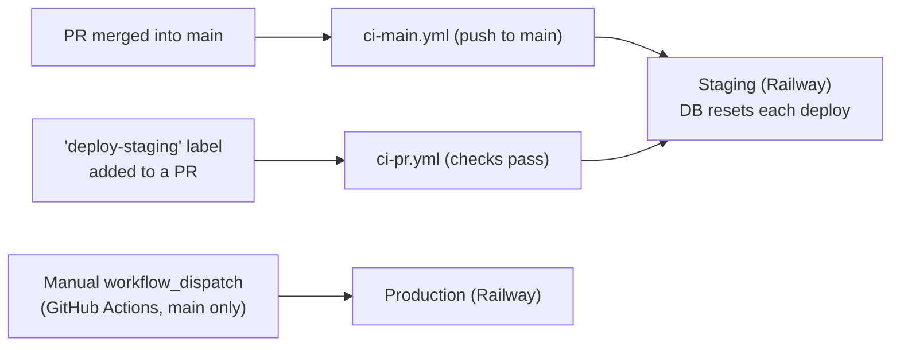
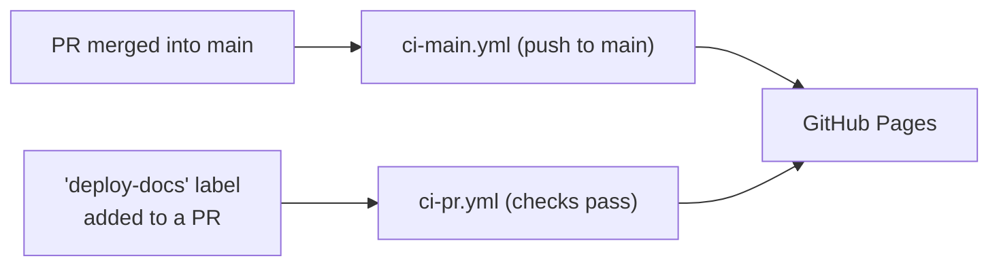

# Contributing

Setup, conventions, and workflows for developing this repo. For the project's purpose and end-user
install instructions, see [`README.md`](README.md).

## Getting Started

```bash
git clone <repo-url>
cd ripe
pnpm install
```

## Coding Standards

See [`STANDARDS.md`](STANDARDS.md) for conventions that apply across the whole workspace, and the
per-package files for package-specific rules: [`api/STANDARDS.md`](api/STANDARDS.md),
[`cli/STANDARDS.md`](cli/STANDARDS.md), [`web/STANDARDS.md`](web/STANDARDS.md).

## Package Commands

Each package (`api`, `./cli`, `web`) exposes the same script names — `lint`, `typecheck`, `test`,
`ci:checks` — via `pnpm --filter <package> <script>`. Only the `--filter` target changes between
packages; check each package's `package.json` for its full script list.

## Manual Local Test

To try a change end-to-end against a real local stack:

**1. API** — edit `DATABASE_PATH`/`PORT` if needed, then start it:

```bash
cp api/.env.local.example api/.env.local
pnpm --filter api start:local
```

Runs at `http://localhost:<PORT>`.

**2. CLI** — build and run it against the local API:

```bash
pnpm --filter ./cli build
node cli/dist/index.js init
```

When prompted for the server URL, pass `http://localhost:<PORT>` (the API's `PORT` from step 1).

**3. Web** — start the dev server:

```bash
pnpm --filter web dev
```

Proxies `/api` to `http://localhost:3000`.

## Runtime & Package Manager Versions

Node and pnpm versions are pinned in `package.json`, read by different tools:

| Field                    | Set for | Read by                                                                                                      |
| ------------------------ | ------- | ------------------------------------------------------------------------------------------------------------ |
| `devEngines` + `engines` | Node    | `actions/setup-node` (devEngines, falls back to `engines`); Railway's Railpack builder (`engines.node` only) |
| `packageManager`         | pnpm    | `pnpm/action-setup` in CI; pnpm itself locally                                                               |

Both Node fields are kept in sync so every stage resolves the same version.

**Bumping a version**: check the target pnpm version's own Node support range first, then update
all three fields together:

```bash
npm view pnpm@<version> engines
```

Renovate bumps `packageManager` and `engines`/`devEngines` independently and doesn't cross-check
them — an incompatible pair fails `pnpm install` closed (`engineStrict`/`pmOnFail`, both enforced
locally by pnpm) instead of merging silently. If that happens, work out a compatible pair manually
as above.

**Locally**: pnpm auto re-execs to the pinned `packageManager` version on mismatch (via Corepack,
Homebrew, or a global install — `pmOnFail`), and refuses to install/build on a Node mismatch
(`engineStrict`). [mise](https://mise.jdx.dev) users get the same pins for free — this repo's
`.mise.toml` reads `devEngines`/`engines`/`packageManager` once you run `mise trust` in the repo.

## Dependency Updates

[Renovate](https://docs.renovatebot.com) runs self-hosted via `.github/workflows/renovate.yml` +
`renovate.json` (not the hosted GitHub App). Cadence comes entirely from that workflow's own
`cron` triggers — not Renovate's `schedule`/`timezone` config — so there's only one clock to
reason about:

| Cadence           | Config                          | Scope                                       | Merge                               |
| ----------------- | ------------------------------- | ------------------------------------------- | ----------------------------------- |
| Weekly (Mon)      | `.github/renovate/weekly.json`  | minor/patch/pin/digest, grouped into one PR | auto-merged once `ci-pr.yml` passes |
| Monthly (the 1st) | `.github/renovate/monthly.json` | major only, one PR per dependency           | manual — needs a changelog read     |

Safety nets:

- **7-day `minimumReleaseAge`**, enforced both by Renovate and by pnpm at install time
  (`pnpm-workspace.yaml`'s `minimumReleaseAgeStrict`) across the whole dependency graph.
- **Build scripts** only run for packages allow-listed in `pnpm-workspace.yaml`'s `allowBuilds`.
- **`devEngines`/`engines` sync**: a custom regex manager in `renovate.json` keeps
  `devEngines.runtime.version` bumped alongside `engines.node`, since Renovate's npm manager
  doesn't track `devEngines` natively.

Validate `renovate.json` after editing it: `pnpm renovate:validate`. To dry-run either config from
an open PR without waiting for its cron, add the `test-renovate-weekly` or `test-renovate-monthly`
label — same pattern as the `deploy-staging`/`deploy-docs` labels below (always `dryRun: full`, so
neither can open real PRs or push branches).

## Deployment

Built via [Railpack](https://railpack.com) (`railpack.json`), hosted on
[Railway](https://railway.com). `main` is protected — merging a PR is what triggers a staging
deploy.



Adding the `deploy-staging` label to an open PR deploys that branch to staging once all checks
pass — useful for testing a change before merging.

### Architecture Docs Publishing

The [C4 architecture diagrams](docs/architecture/architecture.c4) are built with
[LikeC4](https://likec4.dev) and published to GitHub Pages:
**<https://paulelian-tabarant.github.io/ripe/>**.



Adding the `deploy-docs` label to an open PR that touches `docs/architecture/**` publishes that
branch's diagrams to the same URL — useful for previewing changes before merging. There's a single
Pages destination (no separate staging/production split), so the most recent deploy — whether from
a labeled PR or a `main` merge — is what's live.
