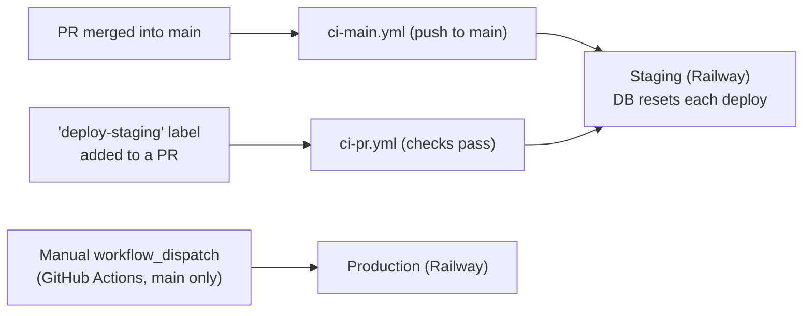
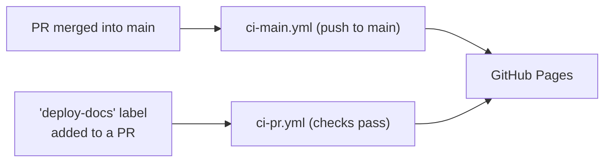

# 🍇 Ripe

**Visibility into which custom skills are actually being used by your coding agent teams.**

> **License:** Free for personal and non-commercial use under the PolyForm Noncommercial License
> 1.0.0. For commercial use, please contact <paul.tabarant@gmail.com> to obtain a commercial license.

## The Problem

Teams create custom skills for their coding agents but have no way to know:

- Which skills are actually being invoked
- Which team members leverage skills effectively  
- Whether a skill is worth maintaining or should be deprecated

## The Solution

This project tracks skill invocation events across teams, providing:

- **Invocation metrics**: which skills are used, how often, and by whom
- **Usage rankings**: identify most and least-used skills over time
- **Deprecation signals**: detect unused skills that may need attention

Focus is on custom `.claude/skills/` defined within projects — the skills teams maintain themselves
— not third-party plugins.

## Getting Started

```bash
git clone <repo-url>
cd ripe
pnpm install
```

### Runtime & Package Manager Versions

Node and pnpm versions are pinned in `package.json`, but different parts of the SDLC read
different fields:

- **Node**: declared in both `devEngines` and `engines`. Locally and in CI, `actions/setup-node`
  reads `devEngines` first, falling back to `engines` only if it's absent. At deploy time,
  Railway's Railpack builder reads `engines.node` directly and doesn't know about `devEngines`.
- **pnpm**: pinned via `packageManager`, read by `pnpm/action-setup` in CI's setup step.

Both Node fields are kept in sync so every stage resolves the same version.

**Bumping either version**: pnpm itself declares which Node versions it supports via its own
`engines.node` field. Before pinning a new pnpm version, check that field against the Node version
you intend to pin:

```bash
npm view pnpm@<version> engines
```

Pick a Node version that satisfies the range it reports, then update `devEngines`, `engines`, and
`packageManager` together so every stage (CI, Railpack, mise) resolves the same compatible pair.

**Using [mise](https://mise.jdx.dev) locally**: mise doesn't pick up `devEngines` or
`packageManager` automatically by default. This repo's `.mise.toml` enables idiomatic version
files for `node` and `pnpm` (see mise's [Node docs](https://mise.jdx.dev/lang/node.html)), so
`mise current node`/`mise current pnpm` resolve to the versions pinned in
`devEngines`/`engines`/`packageManager` once you run `mise trust` the first time you `cd` into
the repo.

pnpm itself also guards the `packageManager` pin natively (`pmOnFail`, default `download`): any
locally installed `pnpm` binary — via Corepack, Homebrew, or a global install — detects a mismatch
against `packageManager` and transparently re-execs the pinned version, so this doesn't rely on
Corepack being enabled.

### Dependency Updates

[Renovate](https://docs.renovatebot.com) runs weekly via a self-hosted GitHub Actions workflow
(`.github/workflows/renovate.yml` + `renovate.json`) rather than the hosted GitHub App.

- **Minor/patch**: grouped into a single weekly PR, auto-merged once `ci-pr.yml` passes.
- **Major**: one PR per dependency, opened monthly, never auto-merged — needs a changelog read and
  manual verification.
- **Supply-chain safety**: a 7-day `minimumReleaseAge` is enforced twice. Renovate itself won't
  propose a dependency update until it's at least 7 days old, and pnpm independently re-checks the
  same policy at install time (`pnpm-workspace.yaml`, `minimumReleaseAgeStrict: true`) across the
  whole dependency graph, including transitive dependencies — failing the install rather than
  silently letting a too-fresh package through.
- **Build scripts**: native/postinstall scripts only run for packages explicitly allow-listed in
  `pnpm-workspace.yaml`'s `allowBuilds`.
- **`devEngines`/`engines` sync**: Renovate's built-in npm manager doesn't track `devEngines`, so a
  custom regex manager in `renovate.json` keeps `devEngines.runtime.version` bumped alongside
  `engines.node` whenever Renovate proposes a Node update.

Validate `renovate.json` after editing it: `pnpm renovate:validate`.

### API (`api/`)

```bash
cp api/.env.local.example api/.env.local   # edit DATABASE_PATH/PORT if needed
pnpm --filter api start:local   # dev server, http://localhost:<PORT>
pnpm --filter api test
```

### Web (`web/`)

```bash
pnpm --filter web dev   # vite dev server, proxies /api to http://localhost:3000
pnpm --filter web test
```

### CLI (`cli/`)

```bash
pnpm --filter ./cli cli <command-name>   # builds, then runs the CLI — e.g. `init`
pnpm --filter ./cli test
```

The instructions below cover testing the `init` command against a locally running API. To test
it, pass `http://localhost:<PORT>` when prompted for the server URL, using the `PORT` value from
`api/.env.local`. The API must already be running (`pnpm --filter api start:local`).

## Deployment

Built via [Railpack](https://railpack.com) (`railpack.json`), hosted on
[Railway](https://railway.com). `main` is protected — merging a PR is what triggers a staging
deploy.



Adding the `deploy-staging` label to an open PR deploys that branch to staging once all checks
pass — useful for testing a change before merging.

### Architecture Docs

The [C4 architecture diagrams](docs/architecture/architecture.c4) are built with
[LikeC4](https://likec4.dev) and published to GitHub Pages:
**<https://paulelian-tabarant.github.io/ripe/>**.



Adding the `deploy-docs` label to an open PR that touches `docs/architecture/**` publishes that
branch's diagrams to the same URL — useful for previewing changes before merging. There's a single
Pages destination (no separate staging/production split), so the most recent deploy — whether from
a labeled PR or a `main` merge — is what's live.

## License

This project is licensed under the [PolyForm Noncommercial License 1.0.0](LICENSE). In plain
language: you're free to use, modify, and share this software for personal, educational, research,
and other noncommercial purposes, but commercial use requires a separate commercial license.
Contact <paul.tabarant@gmail.com> for commercial licensing.
