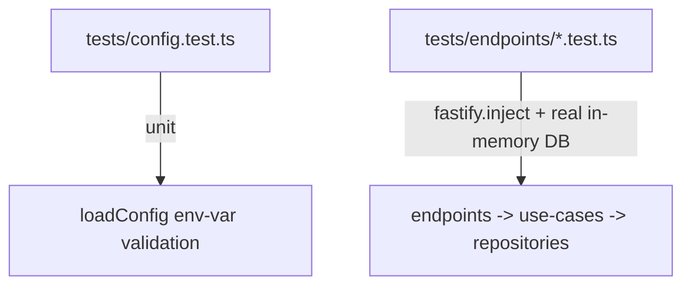

# Coding Standards — `api/`

Package-specific standards for `api/`. These supplement the general rules in
[`../STANDARDS.md`](../STANDARDS.md) and the architecture notes in [`CLAUDE.md`](CLAUDE.md).

## Architecture

- **Three-layer split**: endpoints → use-cases → repositories. Endpoints validate the request
  shape (JSON Schema) and translate results to HTTP status codes; use-cases hold business logic,
  one class per use case with `run()` as the single public method; repositories hold raw SQL
  only. Don't skip a layer (no SQL in endpoints, no HTTP concerns in use-cases).
- **Expected outcomes as typed results**: outcomes like "project already exists" are typed
  return values (e.g. `RegisterProjectResult`), which endpoints map to status codes (see the
  general result-objects-over-throwing rule in [`../STANDARDS.md`](../STANDARDS.md);
  `loadConfig()` throwing on missing env vars is the kind of startup condition that's genuinely
  exceptional instead).
- **No `console.*` in `src/`**: application code communicates via Fastify's request/reply and
  return values, not console output; logging belongs to Fastify's own logger, not ad hoc
  `console` calls.
- **Migrations**: schema changes go in `src/db/migrations.ts` as versioned entries with `up`/
  `down` SQL, applied via `migrateDatabase(db)`. Never hand-edit the schema outside a migration.
- **No DB details leaking into use-cases**: repositories don't leak row shapes or column naming
  into the use-case layer — repository functions return domain-shaped objects, so use-cases
  never reference raw table/column names.
- **No HTTP details leaking into use-cases**: use-cases don't reference HTTP concepts (status
  codes, request/response shapes, headers) — that mapping belongs to endpoints.
- **Repositories return the domain entity itself when one exists**: a repository method whose
  result corresponds to a real domain entity (e.g. `getByRepoKey`) returns that entity class
  (`Project`) directly, constructed via the entity's own reconstitution factory — not a separately
  declared plain-object type mirroring the same fields. Reserve a dedicated `*ReadModel` type for
  a query shaped for one specific reading need that doesn't correspond to a full entity (e.g.
  `ProjectReadModel`, the `{id, name}` projection `list()` returns for a list view — no `repoKey`,
  no behavior, not the same thing as a `Project`). Don't let `*ReadModel` do double duty as "the
  entity, but plain-object" — that's what returning the entity class itself is for.
- **Validation is separate from construction, so "does it already exist" can be checked before
  "create" is ever invoked**: when a use-case must look up an entity by a value derived from its
  input before deciding whether to create one, don't fold derivation and construction into a
  single fallible `create` — invoking something named `create` before knowing creation is even
  warranted reads backwards. Split the entity's static factory in two: a validating derivation
  step with no side effects (e.g. `Project.deriveIdentity(remoteUrl): ProjectIdentity |
  InvalidRemoteUrlError`, parsing `remoteUrl` into the `repoKey` used for the lookup plus whatever
  else construction will need) that a use-case calls first and can fail; and an infallible
  `create(name, identity)` that only builds the entity (assigning its `id`, here via `nanoid`) —
  called only in the branch where the lookup came back empty. A repository's `getByRepoKey`-style
  method never calls either of these — it reconstitutes an already-valid entity read back from
  storage via a third factory, `reconstitute(data)`, which also can't fail (the data was already
  validated once, at the `create` call that originally persisted it).
- **Domain entity classes have a private constructor**, exposing only their static factories
  (`deriveIdentity`/`create`/`reconstitute` above). Name the class after the bare entity
  (`Project`); this is distinct from the plain `*ReadModel` DTOs living in `src/repositories/` —
  the domain class carries behavior and invariants, a `*ReadModel` is a plain data shape for one
  specific reading need. The repository's write parameter is the entity itself (see
  `addNewProject(project: Project)`), not a separately-declared write DTO. Reserve a use-case
  (`src/use-cases/`) for logic that orchestrates repositories or multiple entities rather than an
  invariant intrinsic to one entity.

## Testing

General testing principles live in [`../STANDARDS.md`](../STANDARDS.md). This section covers
only the `api/`-specific test layout.

- **Unit vs. endpoint split**: `tests/config.test.ts` is the one pure unit test — `loadConfig()`
  env-var validation, no server involved. Everything else is an endpoint test under
  `tests/endpoints/`, exercised via `fastify.inject()` against a real in-memory
  `better-sqlite3` database — no mocking of endpoints, use-cases, or repositories.

