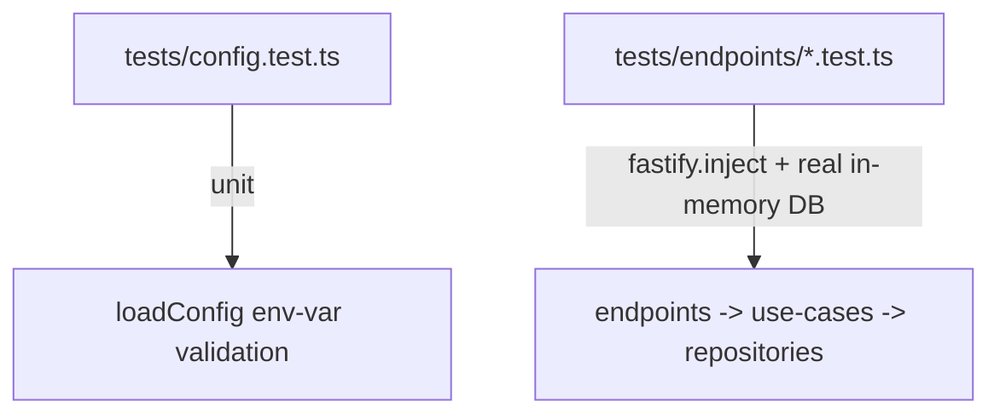

# Coding Standards — `api/`

Package-specific standards for `api/`. These supplement the general rules in
[`../STANDARDS.md`](../STANDARDS.md) and the architecture notes in [`CLAUDE.md`](CLAUDE.md).

## Architecture

- **Three-layer split**: endpoints → use-cases → repositories. Endpoints validate the request
  shape (JSON Schema) and translate results to HTTP status codes; use-cases hold business logic,
  one class per use case with `run()` as the single public method; repositories hold raw SQL
  only. Don't skip a layer (no SQL in endpoints, no HTTP concerns in use-cases).
- **Expected outcomes as typed results**: outcomes like "project already exists" are typed
  return values (e.g. `RegisterProjectResult`), which endpoints map to status codes (see the
  general result-objects-over-throwing rule in [`../STANDARDS.md`](../STANDARDS.md);
  `loadConfig()` throwing on missing env vars is the kind of startup condition that's genuinely
  exceptional instead).
- **No `console.*` in `src/`**: application code communicates via Fastify's request/reply and
  return values, not console output; logging belongs to Fastify's own logger, not ad hoc
  `console` calls.
- **Migrations**: schema changes go in `src/db/migrations.ts` as versioned entries with `up`/
  `down` SQL, applied via `migrateDatabase(db)`. Never hand-edit the schema outside a migration.
- **No DB details leaking into use-cases**: repositories don't leak row shapes or column naming
  into the use-case layer — repository functions return domain-shaped objects, so use-cases
  never reference raw table/column names.
- **No HTTP details leaking into use-cases**: use-cases don't reference HTTP concepts (status
  codes, request/response shapes, headers) — that mapping belongs to endpoints.
- **Domain object vs. read/write model naming**: don't let one type do double duty across reading
  and writing an entity if their fields diverge or the write side carries coherence obligations
  the read side doesn't (e.g. which fields are required to create a row vs. what comes back from
  a lookup). Reserve the bare domain name (e.g. `Project`) for a type with no such split — used
  identically for reading and writing. Once a type serves only one side, suffix it accordingly on
  the same base name instead of reusing the bare name or inventing an unrelated one: `ReadModel`
  for a type returned by a read operation (e.g. `ProjectReadModel` from `getByRepoKey`),
  `CreationModel` for the shape a write operation needs to create a new row (e.g.
  `ProjectCreationModel` for `addNewProject`'s parameter). This keeps each type's role explicit
  while keeping same-entity types recognizably related.

## Testing

General testing principles live in [`../STANDARDS.md`](../STANDARDS.md). This section covers
only the `api/`-specific test layout.

- **Unit vs. endpoint split**: `tests/config.test.ts` is the one pure unit test — `loadConfig()`
  env-var validation, no server involved. Everything else is an endpoint test under
  `tests/endpoints/`, exercised via `fastify.inject()` against a real in-memory
  `better-sqlite3` database — no mocking of endpoints, use-cases, or repositories.

