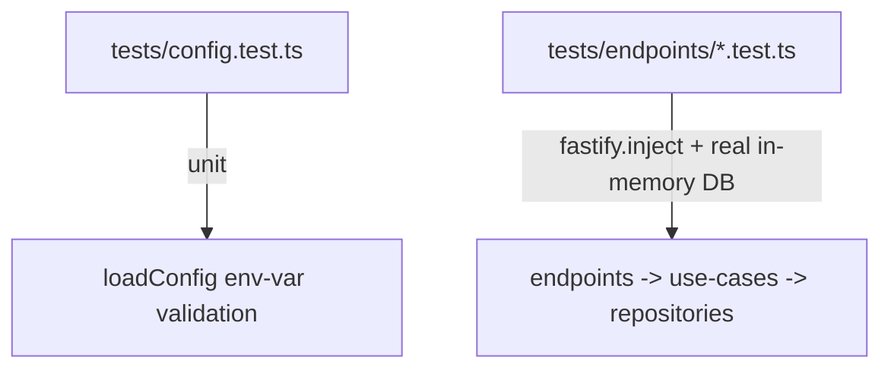

# Coding Standards — `api/`

Package-specific standards for `api/`. These supplement the general rules in
[`../STANDARDS.md`](../STANDARDS.md) and the architecture notes in [`CLAUDE.md`](CLAUDE.md).

## Architecture

### Layering

- **Three-layer split**: endpoints → use-cases → repositories. Endpoints validate the request
  shape (JSON Schema) and translate results to HTTP status codes; use-cases hold business logic,
  one class per use case with `run()` as the single public method; repositories hold raw SQL
  only. Don't skip a layer (no SQL in endpoints, no HTTP concerns in use-cases).
- **Expected outcomes as typed results**: outcomes like "project already exists" are typed
  return values (e.g. `RegisterProjectResult`), which endpoints map to status codes (see the
  general result-objects-over-throwing rule in [`../STANDARDS.md`](../STANDARDS.md);
  `loadConfig()` throwing on missing env vars is the kind of startup condition that's genuinely
  exceptional instead).
- **No DB details leaking into use-cases**: repositories don't leak row shapes or column naming
  into the use-case layer — repository functions return domain-shaped objects, so use-cases
  never reference raw table/column names.

  ```ts
  // ❌ raw column name leaks into the use-case
  const row = repo.getRow(id)
  const isActive = row.is_active === 1

  // ✅ repository translates the row into a domain-shaped object
  const project = repo.getByRepoKey(repoKey) // returns Project, not ProjectRow
  ```

  **Rule**: if a use-case needs to know a column name to read a value, that translation belongs
  in the repository, not the use-case.
- **No HTTP details leaking into use-cases**: use-cases don't reference HTTP concepts (status
  codes, request/response shapes, headers) — that mapping belongs to endpoints.

### File Naming

- **Everything is kebab-case.** No camelCase filenames (`createTestDb.ts` → `create-test-db.ts`).
- **A dot-suffix (`.role.ts`) marks a file as an already-established, named architectural
  role** — one that's documented as its own layer/pattern elsewhere in `CLAUDE.md`/`STANDARDS.md`,
  not just a description of what the file happens to do. Established roles today:
  `*.endpoints.ts` (Fastify plugin, e.g. `health.endpoints.ts`) and `*.repository.ts` (raw-SQL
  repository, e.g. `project.repository.ts`). A test file mirrors the suffix of the file it tests
  (`*.endpoints.test.ts`).
- **A bare kebab-case name (no role suffix)** is for anything that doesn't carry one of those
  established role tags — domain entities and value objects (`project.ts`,
  `git-repository.ts`), use-cases (`list-projects.ts`, `register-project.ts`),
  `config.ts`. Don't invent a new dot-suffix for a one-off shape; only promote something to a
  dot-suffix once it's actually documented as a recurring architectural pattern, not merely
  renamed to look consistent.
- **Test-only utilities are isolated in `tests/helpers/`** (`create-test-db.ts`,
  `post-projects.ts`), kept out of `tests/endpoints/` so a directory listing distinguishes actual
  test suites from the plain functions they call.

### Persistence & Infra

- **No `console.*` in `src/`**: application code communicates via Fastify's request/reply and
  return values, not console output; logging belongs to Fastify's own logger, not ad hoc
  `console` calls — the strictest form of the general injectable-output-sink rule in
  [`../STANDARDS.md`](../STANDARDS.md) (`cli/` allows direct user-facing output, but only through
  an injected dependency — see [`../cli/STANDARDS.md`](../cli/STANDARDS.md)).
- **Migrations**: schema changes go in `src/infrastructure/db/migrations.ts` as versioned entries with `up`/
  `down` SQL, applied via `migrateDatabase(db)`. Never hand-edit the schema outside a migration.

### Domain Modeling

- **Repositories return the domain entity itself when one exists**: a repository method whose
  result corresponds to a real domain entity (e.g. `getByRepoKey`) returns that entity class
  (`Project`) directly, constructed via the entity's own reconstitution factory — not a separately
  declared plain-object type mirroring the same fields.

  ```ts
  // ✅ full entity, reconstituted
  getByRepoKey(repoKey: string): Project | undefined

  // ✅ projection for one specific reading need — not a stand-in for Project
  list(): ProjectReadModel[] // { id, name } — no repoKey, no behavior
  ```

  Reserve a dedicated `*ReadModel` type for a query shaped for one specific reading need that
  doesn't correspond to a full entity. Don't let `*ReadModel` do double duty as "the entity, but
  plain-object" — that's what returning the entity class itself is for.
- **Derive and validate external input into a small value object before it ever reaches the
  entity's own factory** — don't have the entity's `create` re-parse a raw external value itself.

  ```ts
  // ProjectRepoReference: private constructor, sole entry point is `resolve`
  ProjectRepoReference.resolve(remoteUrl: string): ProjectRepoReference | InvalidRemoteUrlError

  // Project.create takes the already-validated value object, not the raw string —
  // an invalid ProjectRepoReference can't reach it, so create is infallible
  Project.create(name: string, repoReference: ProjectRepoReference): Project
  ```

  - There's no error branch left to duplicate or forget inside `create` — an invalid
    `GitRepository` is simply unrepresentable by the time it runs.
  - A use-case resolves the value object first, uses its derived fields (e.g.
    `repoReference.repoKey`) for the existence check, and only calls `create` in the "doesn't
    exist yet" branch — `create` is no longer called speculatively before that check, since
    there's no fallible work left inside it to justify calling it early.
  - Give a value object like this its own file once it carries real behavior/invariants of its
    own (here `src/core/domain/git-repository.ts`, separate from `project.ts`) rather than
    nesting it inside the entity that consumes it — and name it for what it actually represents,
    not a neighboring concept: `GitRepository` bundles `repoKey` and `remoteUrl` together
    deliberately (both derived from the same parse, both required before an entity can be
    constructed), but is not itself "the project's identity" (that's `Project.id`) and is not a
    `*Repository` in the persistence-layer sense — hence the more specific name over a generic
    `RepoIdentity`.
  - A repository's `getByRepoKey`-style method never calls `create` — it reconstitutes an
    already-valid entity read back from storage via a separate factory, `reconstitute(data)`,
    which can't fail (the data was already validated once, at the `create` call that originally
    persisted it).

  **Design history**: an earlier version of this rule argued for calling `create` unconditionally,
  up front, specifically to avoid the value-object split above — that traded away a real
  invariant, letting `RegisterProject.run` accept an unvalidated raw string as an implicit
  precondition for a supposedly-infallible-in-practice `create` call. The value-object split
  removes that implicit precondition entirely: `create` cannot be called with anything invalid,
  full stop, not merely "in practice, given how callers currently behave."
- **Domain entity classes have a private constructor**, exposing only their static factories
  (`create`/`reconstitute` above). Name the class after the bare entity (`Project`) — this is
  distinct from the plain `*ReadModel` DTOs living in `src/repositories/`: the domain class
  carries behavior and invariants, a `*ReadModel` is a plain data shape for one specific reading
  need.

  ```ts
  class Project {
    private constructor(/* ... */) {}

    static create(name: string, repoReference: ProjectRepoReference): Project { /* ... */ }
    static reconstitute(data: ProjectRow): Project { /* ... */ }
  }
  ```

  - The repository's write parameter is the entity itself (see `addNewProject(project:
    Project)`), not a separately-declared write DTO.
  - Reserve a use-case (`src/core/use-cases/`) for logic that orchestrates repositories or multiple
    entities, rather than an invariant intrinsic to one entity.

## Testing

General testing principles live in [`../STANDARDS.md`](../STANDARDS.md). This section covers
only the `api/`-specific test layout.

- **Unit vs. endpoint split**: `tests/config.test.ts` is the one pure unit test — `loadConfig()`
  env-var validation, no server involved. Everything else is an endpoint test under
  `tests/endpoints/`, exercised via `fastify.inject()` against a real in-memory
  `better-sqlite3` database — no mocking of endpoints, use-cases, or repositories.


