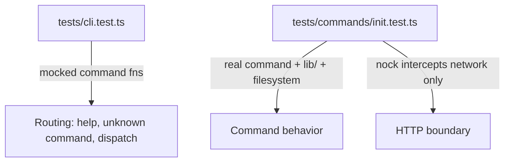

# Coding Standards — `cli/`

Package-specific standards for `cli/`. These supplement the general rules in
[`../STANDARDS.md`](../STANDARDS.md) and the architecture notes in [`CLAUDE.md`](CLAUDE.md).

## Architecture

- **Layer split**: `src/commands/` holds orchestration logic; `src/lib/` holds single-purpose
  helpers (HTTP calls, config file I/O). Don't mix the two — a command function should read as a
  sequence of calls into `lib/`, not inline `fs`/`fetch` logic.
- **Dependency injection for testability**: side-effecting inputs (current working directory,
  interactive prompts) are passed in as optional parameters with real defaults (see
  `InitOptions.currentDirectoryName`, `InitOptions.promptFn` in `src/commands/init.ts`), so tests
  can inject fakes instead of touching the real filesystem or stdin.
- **Exit codes are not a command concern**: commands return a semantic success/error status, not
  an `exitCode`. Mapping that status to an `exitCode` and calling `process.exit` happens in
  `src/cli.ts`/`src/index.ts`, never inside a command.
- **Typed results over ad hoc shapes**: functions that call out to the network return a typed
  result object (e.g. `ProjectRegistrationResult`) rather than a bare `Response` or `unknown`.
- **No `node:process` details in commands**: commands don't read `process.argv`/`process.env` or
  touch stdin/stdout directly — those are read in `src/index.ts` and passed in as parameters.
- **No logging details in commands**: commands don't call `console.*` or any logger directly —
  they return a typed result/message, and `src/index.ts` is responsible for printing it.

## Testing

General testing principles live in [`../STANDARDS.md`](../STANDARDS.md). This section covers
only the `cli/`-specific test layout.

- **Test split mirrors the layer split**: `tests/cli.test.ts` covers command routing — help
  flags, unknown-command handling, dispatch — with each command mocked (e.g. `initFn: vi.fn()`),
  never exercising real command logic. `tests/commands/<command>.test.ts` covers that command in
  isolation, running through every real layer underneath it (`lib/`, filesystem) except the
  network, which is intercepted with `nock`.

