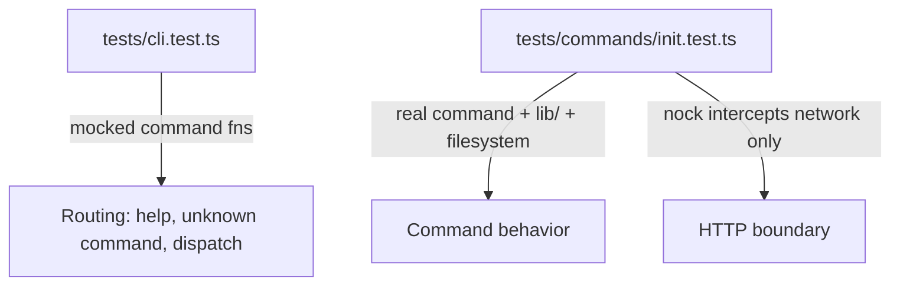

# Coding Standards — `cli/`

Package-specific standards for `cli/`. These supplement the general rules in
[`../STANDARDS.md`](../STANDARDS.md) and the architecture notes in [`CLAUDE.md`](CLAUDE.md).

## Architecture

### Layering

- **Layer split**: `src/commands/` holds orchestration logic; `src/lib/` holds single-purpose
  helpers (HTTP calls, config file I/O). Don't mix the two — a command function should read as a
  sequence of calls into `lib/`, not inline `fs`/`fetch` logic.

### Command Boundaries

- **Dependency injection for testability**: side-effecting inputs (current working directory,
  interactive prompts) are passed in as optional parameters with real defaults — `init`'s
  instance of the general injection rule in [`../STANDARDS.md`](../STANDARDS.md).

  ```ts
  interface InitOptions {
    currentDirectoryName?: () => string // defaults to process.cwd()
    promptFn?: (question: string) => Promise<string> // defaults to a real stdin prompt
  }
  ```

- **Exit codes are not a command concern**: commands return a semantic success/error status, not
  an `exitCode`. Mapping that status to an `exitCode` and calling `process.exit` happens in
  `src/cli.ts`/`src/index.ts`, never inside a command.

  ```ts
  // src/commands/init.ts
  async function init(options: InitOptions): Promise<{ status: 'success' | 'error' }> { /* ... */ }

  // src/index.ts
  const result = await init(options)
  process.exit(result.status === 'success' ? 0 : 1)
  ```

- **Typed results over ad hoc shapes**: functions that call out to the network return a typed
  result object (e.g. `ProjectRegistrationResult`) rather than a bare `Response` or `unknown`.
- **No `node:process` details in commands**: commands don't read `process.argv`/`process.env` or
  touch stdin/stdout directly — those are read in `src/index.ts` and passed in as parameters.
- **No direct `console.*` calls in command logic**: unlike `api/` (which forbids console output
  outright — see [`../api/STANDARDS.md`](../api/STANDARDS.md)), a command's user-facing output is
  legitimate, but it goes through an injected output dependency, not a bare `console.log`/
  `console.error` call inside the command — the same injection rule as above, applied to output
  sinks (see the general rule in [`../STANDARDS.md`](../STANDARDS.md)).

  ```ts
  // ❌ command logs directly
  async function init(options: InitOptions) {
    console.log('Project registered')
  }

  // ✅ command calls an injected output dependency
  interface InitOptions {
    logFn?: (message: string) => void // defaults to console.log
  }

  async function init(options: InitOptions) {
    const logFn = options.logFn ?? console.log
    logFn('Project registered')
  }
  ```

## Testing

General testing principles live in [`../STANDARDS.md`](../STANDARDS.md). This section covers
only the `cli/`-specific test layout.

- **Test split mirrors the layer split**: `tests/cli.test.ts` covers command routing — help
  flags, unknown-command handling, dispatch — with each command mocked (e.g. `initFn: vi.fn()`),
  never exercising real command logic. `tests/commands/<command>.test.ts` covers that command in
  isolation, running through every real layer underneath it (`lib/`, filesystem) except the
  network, which is intercepted with `nock`.


```mermaid
flowchart TD
    A[tests/cli.test.ts] -->|mocked command fns| B[Routing: help, unknown command, dispatch]
    C[tests/commands/init.test.ts] -->|real command + lib/ + filesystem| D[Command behavior]
    C -->|nock intercepts network only| E[HTTP boundary]
```
