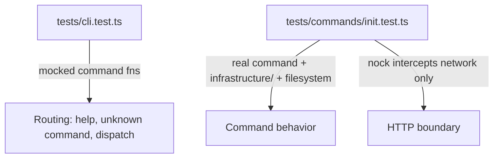

# Coding Standards — `cli/`

Package-specific standards for `cli/`. These supplement the general rules in
[`../STANDARDS.md`](../STANDARDS.md) and the architecture notes in [`CLAUDE.md`](CLAUDE.md).

## Architecture

### Layering

- **Layer split**: `src/commands/` holds orchestration logic; `src/infrastructure/` holds single-purpose
  helpers (HTTP calls, config file I/O). Don't mix the two — a command function should read as a
  sequence of calls into `infrastructure/`, not inline `fs`/`fetch` logic.
- **External dependencies as typed factories**: a command's non-prompt/presenter dependencies
  (filesystem paths, HTTP clients, git) are each a small named interface built via a `createX()`
  factory in `src/infrastructure/`, injected through the command's `*Options` type — not raw functions or
  bare paths threaded through. See `GitRepository`/`SettingsStore`/`CacheStore`/`ProjectDirectory`/
  `ApiClient` in `src/infrastructure/`. `ProjectDirectory` in particular wraps `getCurrentDirectoryName` so
  every other dependency takes `ProjectDirectory`, not a raw `() => string`, and resolves its own
  path convention (e.g. `.ripe/settings.json`) internally.

### File Naming

- **Everything is kebab-case.**
- **A dot-suffix (`.role.ts`) marks a file as an already-established, named architectural
  role** (see the same rule in [`../api/STANDARDS.md`](../api/STANDARDS.md)). In `cli/`, the
  established roles are all under `src/commands/`: `.factory.ts` (composition root for one
  command, e.g. `init.factory.ts`), `.prompter.ts`, `.presenter.ts`.
- **`src/infrastructure/` dependencies are hyphenated, not dot-suffixed** (`git-repository.ts`,
  `settings-store.ts`, `cache-store.ts`, `api-client.ts`, `project-directory.ts`) — these are
  typed factories for one specific external dependency, not instances of a documented,
  repeated pattern the way `.factory`/`.prompter`/`.presenter` are. `GitRepository` in particular
  is not the same concept as `api/`'s `*.repository.ts` (a raw-SQL data-access layer) — it just
  happens to share the English word "repository" for a git repo, so it doesn't get promoted to
  `.repository.ts`. Don't rename one of these to a dot-suffix just for consistency; do it only
  once that specific role is written up as its own recurring pattern here or in `CLAUDE.md`.

### Command Boundaries

- **Dependency injection for testability, via required prompts/presenter objects**: side-effecting
  inputs (current working directory, interactive prompts) and outputs (user-facing messages) are
  passed in as **required** fields — no `options.x ?? defaultX` fallback inside a command. A
  command's questions to the user are grouped into a `*Prompts` interface (methods that return a
  value and drive control flow); everything the command used to tell the user directly is grouped
  into a `*Presenter` interface (one-way `void` notification methods, called at the point each
  fact is known). Reading the environment (e.g. the current directory) is exposed as a callable,
  not a pre-resolved value, since it's one of the command's own questions about its environment —
  same category as "what's the git remote."

  ```ts
  interface InitPrompter {
    promptForServerUrl(): Promise<string>
  }

  interface InitPresenter {
    onProjectCreated(projectId: string): void
    onProjectAlreadyExisting(projectId: string): void
  }

  interface InitOptions {
    projectDirectory: ProjectDirectory // real implementation wraps () => process.cwd()
    prompter: InitPrompter
    presenter: InitPresenter
    gitRepository: GitRepository
    settingsStore: SettingsStore
    cacheStore: CacheStore
  }
  ```

  The one real implementation of each `*Prompter`/`*Presenter`, plus the real dependency
  factories above, are built in the command's own `*.factory.ts` (e.g. `init.factory.ts`), as
  command-specific wording over the generic `ask`/`logFn`/`errorFn`/`warnFn` primitives
  `src/index.ts` passes in — never in `src/cli.ts`, which only routes. See `buildInitPrompter`
  (`init.prompter.ts`), `buildInitPresenter` (`init.presenter.ts`), and `buildInitFn`
  (`init.factory.ts`).

  Prefer one presenter method per distinct outcome (`onProjectCreated`/`onProjectAlreadyExisting`)
  over a single method that branches internally on a result field (e.g.
  `onProjectRegistered(result)` picking a message off `result.wasAlreadyExisting`) — the command
  makes the branch, since that's exercised by existing command tests; the real presenter
  implementation (`init.presenter.ts`) has no test of its own, so branching logic placed there is
  invisible to the test suite.

- **Exit codes are not a command concern**: commands return a semantic success/error status, not
  an `exitCode`. Mapping that status to an `exitCode` and calling `process.exit` happens in
  `src/cli.ts`/`src/index.ts`, never inside a command.

  ```ts
  // src/commands/init.ts
  async function init(options: InitOptions): Promise<'success' | 'error'> { /* ... */ }

  // src/index.ts
  const result = await init(options)
  process.exit(result === 'success' ? 0 : 1)
  ```

- **Typed results over ad hoc shapes**: functions that call out to the network return a typed
  result object (e.g. `ProjectRegistrationResult`) rather than a bare `Response` or `unknown`.
- **No raw `console`/`process.std*`/`readline` access outside `src/index.ts`**: `src/index.ts` is
  the single composition root of the package and the only file allowed to touch `console.*`,
  `process.stdin`/`process.stdout`, or `node:readline` directly. Everywhere else — `src/cli.ts`
  and every command — relies exclusively on injected functions (`ask`/`logFn`/`errorFn`/`warnFn`
  in `src/cli.ts`; `prompter`/`presenter` in commands) for both asking and telling. This is a
  literal, greppable invariant:

  ```bash
  grep -rn 'console\.\|readline\|process\.std' cli/src/   # should only match src/index.ts
  ```

  ```ts
  // ❌ command (or cli.ts) touches the environment directly
  async function init(options: InitOptions) {
    console.log('Project registered')
  }

  // ✅ command calls an injected presenter method instead
  async function init(options: InitOptions) {
    options.presenter.onProjectCreated(projectId)
  }
  ```

## Testing

General testing principles live in [`../STANDARDS.md`](../STANDARDS.md). This section covers
only the `cli/`-specific test layout.

- **Test split mirrors the layer split**: `tests/cli.test.ts` covers command routing — help
  flags, unknown-command handling, dispatch — with each command mocked (e.g. `initFn: vi.fn()`),
  never exercising real command logic. `tests/commands/<command>.test.ts` covers that command in
  isolation, running through every real layer underneath it (`infrastructure/`, filesystem) except the
  network, which is intercepted with `nock`.


```mermaid
flowchart TD
    A[tests/cli.test.ts] -->|mocked command fns| B[Routing: help, unknown command, dispatch]
    C[tests/commands/init.test.ts] -->|real command + infrastructure/ + filesystem| D[Command behavior]
    C -->|nock intercepts network only| E[HTTP boundary]
```
