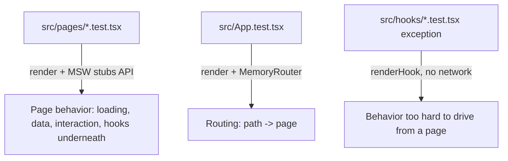

# Coding Standards — `web/`

Package-specific standards for `web/`. These supplement the general rules in
[`../STANDARDS.md`](../STANDARDS.md) and the architecture notes in [`CLAUDE.md`](CLAUDE.md).

## Architecture

- **SPA, dev vs. prod**: `vite` for dev (HMR); `vite build` for prod, served as static assets by
  the API server — no separate web server or SSR.
- **Routing**: `src/App.tsx` declares routes with `<Routes>`/`<Route>`; `src/main.tsx` wraps
  `<App />` in `<BrowserRouter>` (tests use `<MemoryRouter>` — see Testing).
- **Page shell via layout route**: `PageLayout` (`src/components/`) renders `<Outlet />` and wraps
  every route once, as a parent `<Route>` in `App.tsx`. Pages never import it themselves — this is
  how every page gets consistent spacing for free.
- **Atomic design** (ADR-008): shared UI pieces live in `src/components/` (e.g. `LoadingSpinner`,
  `Message`, `ProjectSelector`) as their own files from the start, not extracted later. Pages
  compose them rather than inlining markup.

## Styling

- **Tailwind CSS v4** via `@tailwindcss/vite` — no config file, no PostCSS; just
  `@import "tailwindcss";` in `src/index.css`, imported once from `main.tsx`.
- **No custom design tokens**: use Tailwind's default scale (`gap-2`, `text-sm`, `zinc-900`, …),
  not arbitrary values (`mt-[13px]`, hex literals). Encapsulate color/variant choices inside shared
  components (e.g. `Message`'s `variant` prop) instead of repeating raw classes at each call site.

  ```tsx
  // ❌ arbitrary value + raw classes repeated at each call site
  <div className="mt-[13px] text-[#b91c1c]">Failed to save</div>

  // ✅ default scale, encapsulated in a shared component's variant
  <Message variant="error">Failed to save</Message>
  ```

  **Rule**: if you're reaching for a bracketed arbitrary value or a hex literal, that's a sign the
  choice belongs in a shared component's variant, not at the call site.

## Testing

General testing principles live in [`../STANDARDS.md`](../STANDARDS.md). This section covers
only the `web/`-specific test conventions.

- **Test layers**: default to testing UI-to-network, not hooks in isolation.
  - `src/pages/*.test.tsx` render a full page with MSW stubbing its API calls, exercising real
    hooks/components underneath — the default for anything reachable that way.
  - `src/App.test.tsx` covers routing — which page renders for which path — with MSW responses
    left minimal (e.g. a never-resolving promise) since the page content itself isn't under test
    there.
  - `src/hooks/*.test.tsx` unit tests are the exception, not the default: reach for a bare
    `renderHook` test only when the behavior can't be reliably driven from a page — e.g.
    `useAsync.test.tsx` covers a stale-response race (an older fetch resolving after a newer one)
    that would require orchestrating two overlapping in-flight requests through a full page
    render to reproduce. If a page-level test can trigger the same behavior, prefer that instead.
- **MSW at the network boundary**: `msw` (`src/mocks/server.ts`) intercepts HTTP instead of mocking
  `fetch` — same "boundary, not internals" philosophy `cli/` applies with `nock`.
  - `server` starts with no handlers; each test registers what it needs via `server.use(...)`,
    kept local to that test rather than a shared default-handlers module.
  - Unhandled requests fail the test: `onUnhandledRequest: 'error'` (`vitest.setup.ts`) means
    every request needs a matching handler — including ones that intentionally never resolve
    (`new Promise(() => {})`) to assert a permanent loading state.
- **React Testing Library conventions**:
  - Assert on what a user would see (`screen.getByText`/`findByText`), not implementation
    details or internal state.
  - `MemoryRouter` for router-dependent tests: renders inside `<MemoryRouter>` (optionally with
    `initialEntries`) instead of a real URL, so multiple routes can be exercised in one test
    file — see `src/App.test.tsx`.
  - `@testing-library/user-event` for interaction-driven tests (e.g. dropdown selection in
    `DashboardPage.test.tsx`).
  - Cleanup is manual: `vitest.config.ts` doesn't set `globals: true`, so
    `@testing-library/react`'s auto-cleanup never registers. `vitest.setup.ts` calls `cleanup()`
    explicitly — don't remove it, or DOM from prior tests leaks into the next `render()`.


